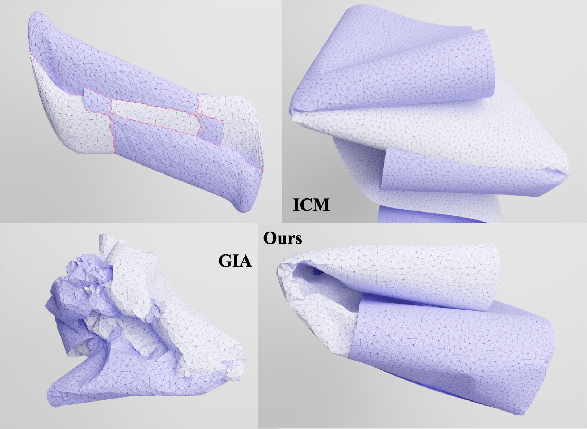
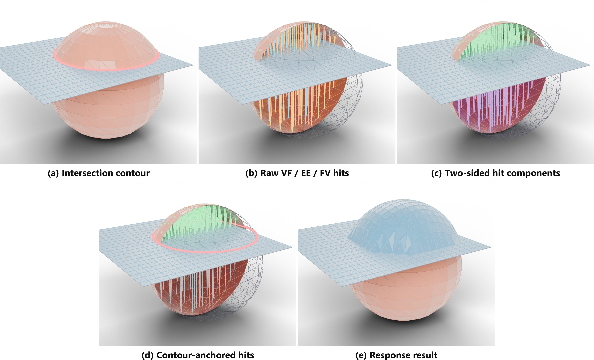
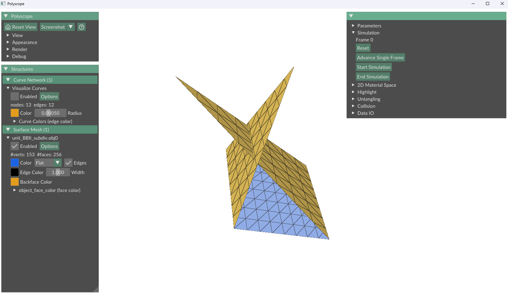
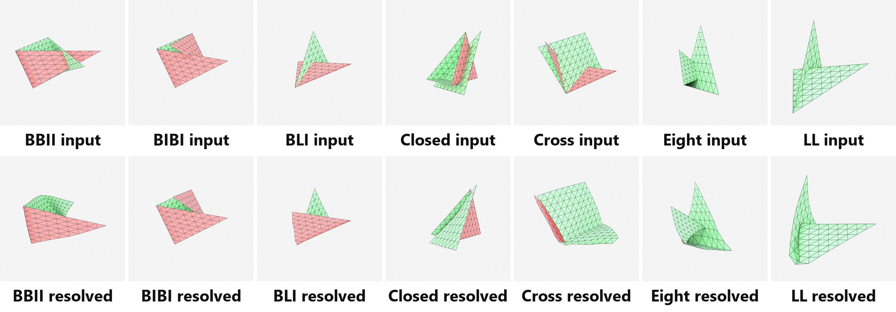
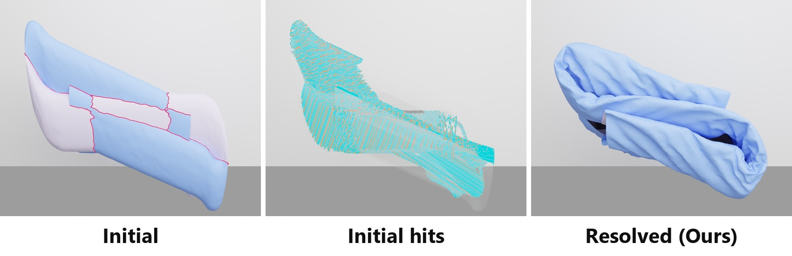
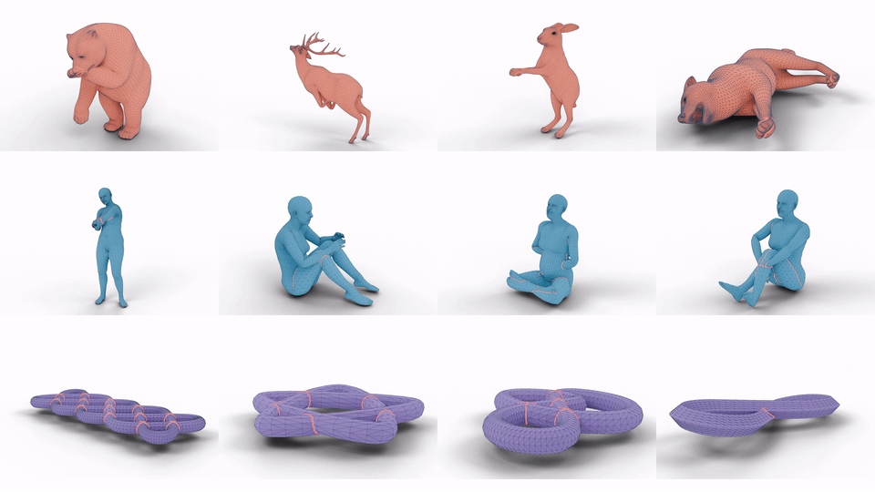
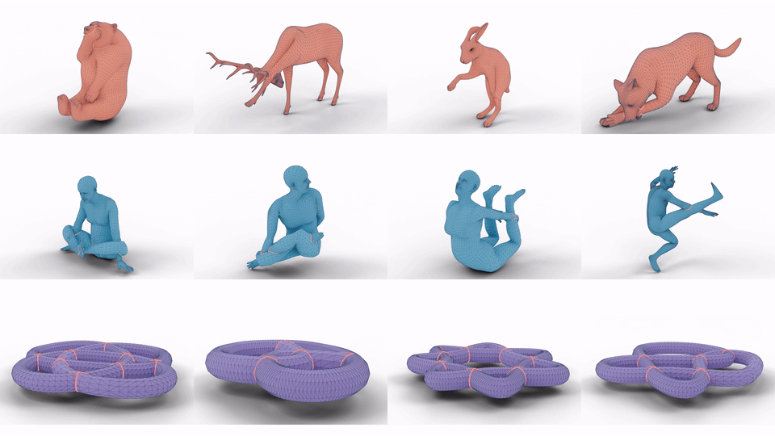

<div align="center">

# Type-Free Global Intersection Analysis with Linear Displacement Fields

### **ACM SIGGRAPH Asia 2026**

**[Chengzhu He](https://chengzhuuwu.github.io/)** &nbsp;·&nbsp; **[Xudong Feng](https://rullec.github.io/)** &nbsp;·&nbsp; **[Anjun Chen](https://chen3110.github.io/)** &nbsp;·&nbsp; **[Dan Song](https://zengjianhao.github.io/DanSongGroup/)** &nbsp;·&nbsp; **[Shihui Guo](https://www.humanplus.xyz/)** &nbsp;·&nbsp; **[Kui Wu](https://kuiwuchn.github.io/)**


<p align="center">
  <a href="https://chengzhuuwu.github.io/publication/siggraph-asia-2026-untangling/"></a>
  <a href="https://chengzhuuwu.github.io/files/untangling_siggraph_asia_2026.pdf"></a>
  <a href="https://chengzhuuwu.github.io/files/untangling_supplemental.pdf"></a>
  <a href="https://youtu.be/cs_592tRAZQ"></a>
</p>

<p align="center">
  <a href="https://github.com/ChengzhuUwU/Untangling26/actions/workflows/build_cmake.yml"></a>
  <a href="https://github.com/ChengzhuUwU/Untangling26/actions/workflows/build_wheels.yml"></a>
</p>

<p align="center">
  
</p>

</div>

---

## Overview

Resolving self-intersections and multi-body penetrations without relying on non-penetrating collision history remains a fundamental challenge in physical simulation. Classical global intersection analysis (**GIA**) relies on explicitly classifying intersection contours into topological taxonomies and constructing 2D separating regions—an approach that easily breaks down on open boundary cuts, self-intersecting figure-eights, or complex multi-sheet nesting. Conversely, local intersection contour minimization (**ICM**) avoids explicit topological classification, but its reliance on local gradient descent along intersection lines frequently leads to severe local-minimum trapping under deep penetrations.

This work introduces a **type-free global intersection analysis** framework. For each contour, given a separation direction $\mathbf{r}\in\mathbb{S}^2$ and its (filtered) hit response support $\mathcal{S}(\mathbf{r})$, we evaluate the separation cost using a mass-weighted $L_2$ displacement metric analogous to the inertial term $\sum_i m_i \|\Delta\mathbf{x}_i\|^2$:

$$
\begin{aligned}
D_{\mathcal{C}}(\mathbf{r})
&=\max_{h\in\mathcal{S}(\mathbf{r})}\delta_h(\mathbf{r})\\
J(\mathbf{r})
&= \sum_{h\in\mathcal{S}(\mathbf{r})} m_h\, D_{\mathcal{C}}(\mathbf{r})^2
 = \rho\, D_{\mathcal{C}}(\mathbf{r})^2 \sum_{h\in\mathcal{S}(\mathbf{r})} A_h
\end{aligned} 
$$

where $m_h = \rho\, A_h$ is the mass associated with hit $h$, computed from the area $A_h$ of its source and destination primitives and the surface density $\rho$, and $D_{\mathcal{C}}(\mathbf{r})$ is the maximum ray travel distance of this contour.
All hits in $\mathcal{S}(\mathbf{r})$ share the same contour depth $D_{\mathcal{C}}$; we treat the area density $\rho$ as a uniform constant and drop it. By minimizing $J(\mathbf{r})$, we select separation paths that reconcile geometric untangling with the physical solver's lowest-energy displacement modes.


Given discrete edge--face (EF) intersection pairs, we treat each intersection contour $\mathcal{C}$ as a topological seed for constructing a separation response. 
For each contour, our pipeline alternates between freezing the physical state $\mathbf{x}$ to find the optimal separation direction $\mathbf{r}^\star = \arg\min J(\mathbf{r})$, 
and freezing $\mathbf{r}^\star$ to advance $\mathbf{x}$ via the global IP solver:

1. **Initialize** directed candidates $\mathbf{r} \in \mathcal{D}_0$ from contour-local geometry;
2. **Cast** to find the raw hit set $\mathcal{H}_{\mathrm{raw}}(\mathbf{r})$ via vertex-face (VF), edge-edge (EE), and face-vertex (FV) intersection tests;
3. **Filter** raw hits via dual-sided product-complex cluster culling, retaining only the physical component $\mathcal{S}(\mathbf{r})$ attached to the detected contour;
4. **Refine** selected candidates using projected Newton or Cauchy steps on $\mathbb{S}^2$, re-evaluating the filtered response objective $J(\mathbf{r})$ at each trial;
5. **Assemble** the final optimized hit set into solver constraints $\{C_k\}$ to advance the physical state $\mathbf{x}$.

<p align="center">
  
</p>

The entire pipeline is history-independent, requires no topological case distinctions or manual contour taxonomy, and is implemented on the GPU via [LuisaCompute](https://github.com/LuisaGroup/LuisaCompute) across CUDA, DirectX 12, Vulkan, and Metal backends.

> **注意 / Disclaimer:**
> **本方案并不提供严格的解相交保证：对于自相交而言，在穿透较为复杂的区域，我们的 Cluster Culling 流程可能无法筛选出有修正语义的 RayCasting Hits；对于刚体相交而言，我们的方案可能会卡在物体的镂空区域。如何进一步提升系统的适用性与鲁棒性，是值得深入研究的方向。**  
> *(Note: This framework does not provide a strict untangling guarantee: for self-intersections in complex penetration configurations, the Cluster Culling procedure may fail to isolate RayCasting hits with restorative semantics; for rigid-body intersections, the method may become trapped in hollow or concave regions. Improving the general applicability and robustness of the system is an open and promising research direction.)*


## Building the Python Module

This project provides Python bindings (`lcs_py`) for simulation scripts, interactive demos, and benchmark reproduction. Because the compiled extension is tied to the Python interpreter ABI selected at configuration time, ensure that the same virtual environment is used for both building and running.

### Windows (CUDA)

Run in a developer PowerShell with CMake, Ninja, and a C++ compiler available:

```powershell
git clone https://github.com/ChengzhuUwU/Untangling26.git
Set-Location Untangling26
git submodule update --init --recursive

python3 -m venv .venv
.venv\Scripts\python.exe -m pip install --upgrade pip
.venv\Scripts\python.exe -m pip install numpy trimesh triangle polyscope

cmake -S . -B build -G Ninja `
  -D CMAKE_BUILD_TYPE=Release `
  -D LCS_BUILD_MAIN_APPLICATION=OFF `
  -D LCS_BUILD_PYBINDINGS=ON `
  -D LCS_PYTHON_EXECUTABLE="$PWD\.venv\Scripts\python.exe" `
  -D LUISA_COMPUTE_ENABLE_CUDA=ON `
  -D LUISA_COMPUTE_ENABLE_METAL=OFF `
  -D LUISA_COMPUTE_ENABLE_DX=OFF `
  -D LUISA_COMPUTE_ENABLE_VULKAN=OFF
cmake --build build --target lcs_py -j 2
```

### Linux (CUDA)

```bash
git clone https://github.com/ChengzhuUwU/Untangling26.git
cd Untangling26
git submodule update --init --recursive

python3 -m venv .venv
.venv/bin/python -m pip install --upgrade pip
.venv/bin/python -m pip install numpy trimesh triangle polyscope

cmake -S . -B build -G Ninja \
  -D CMAKE_BUILD_TYPE=Release \
  -D LCS_BUILD_MAIN_APPLICATION=OFF \
  -D LCS_BUILD_PYBINDINGS=ON \
  -D LCS_PYTHON_EXECUTABLE="$PWD/.venv/bin/python" \
  -D LUISA_COMPUTE_ENABLE_CUDA=ON \
  -D LUISA_COMPUTE_ENABLE_METAL=OFF \
  -D LUISA_COMPUTE_ENABLE_DX=OFF \
  -D LUISA_COMPUTE_ENABLE_VULKAN=OFF
cmake --build build --target lcs_py -j 2
```

For macOS, configure with CUDA disabled and Metal enabled:

```text
-DLUISA_COMPUTE_ENABLE_CUDA=OFF
-DLUISA_COMPUTE_ENABLE_METAL=ON
```

The compiled module is placed in `build/bin`. Benchmark scripts add this path to `sys.path` automatically.

## Demos and Benchmarks

Run all commands from the repository root after building `lcs_py`. On the initial run, LuisaCompute JIT-compiles device kernels (cached under `build/bin/.cache`), so subsequent runs will execute faster. Output files are saved to `output/paper_cases/` (ignored by Git). On Linux/macOS, replace `.venv\Scripts\python.exe` with `.venv/bin/python`, and specify `--backend metal` on macOS.

All five demo entry points use **Polyscope GUI by default**. Add `--headless` for unattended simulation without initializing Polyscope. In the viewer, use **Space / Advance Single Frame** to step and **Run / Start Simulation** to play; pause with **Pause / End Simulation**. The OBJ, Jang, and Thingi10K viewers stop at convergence or their frame budget and keep the result visible until you close the window. Their GUI and headless modes share the same solver settings, stepping, and convergence checks.

**Remove `--headless` from a demo command to enable the Polyscope GUI shown below.** For the canonical loop, run one command with `--scene_id 0` instead.

<p align="center">
  
  <br><em>Polyscope GUI: inspect meshes and advance the simulation interactively.</em>
</p>

### Canonical Configurations (Wicke et al. 2006)

Evaluates the seven canonical intersecting boundary and closed configurations from Wicke et al. (BBII, BIBI, BLI, Closed, Cross, Eight, and LL). The 2026-09-18 dual-metric Option C validation reached zero reported edge–face (EF) intersections in 2–5 solver iterations on both CPU and GPU contour-evaluation paths. Add `--export_debug` when per-frame OBJ/NPZ files are needed:

<p align="center"></p>

For each case:
```powershell
.venv\Scripts\python.exe PythonBindings/tests/demo_unit.py `
    --backend cuda --headless --advance_frames 100 `
    --use_subdivision --subdiv_levels 3 --scene_id 0
```

Or with batching command:

```powershell
0..6 | ForEach-Object {
  .venv\Scripts\python.exe PythonBindings/tests/demo_unit.py `
    --backend cuda --headless --advance_frames 300 `
    --use_subdivision --subdiv_levels 3 --scene_id $_
  if ($LASTEXITCODE -ne 0) { throw "Canonical unit $_ failed" }
}
```

### Synthetic Fold

A procedurally generated multi-layer folding benchmark exhibiting deep, nested self-intersections:

<p align="center"></p>

```powershell
.venv\Scripts\python.exe PythonBindings/tests/demo_synthetic.py `
  --backend cuda --headless --advance_frames 400 `
  --start_from_initial 1 --use_ccd_linesearch 0 `
  --untangling_response_depth 0.005 `
  --max_ef_pairs 10000
```

### Jang59 Benchmark

Animated previews of two groups of benchmark cases. Each group contains four animal, four human, and four miscellaneous meshes; red curves mark detected intersections.

<p align="center">
  
  <br><em>Group 1</em>
</p>

<p align="center">
  
  <br><em>Group 2</em>
</p>

Evaluates against the Instant Self-Intersection Repair (ISIR, Jang et al. 2025) benchmark suite. Sample scenes from the official repository are bundled in the `external/instant-mesh-intersection-repair` submodule:

```powershell
git submodule update --init external/instant-mesh-intersection-repair
```

Validate case ordering and hashes without loading the solver, then run the gate:

```powershell
.venv\Scripts\python.exe PythonBindings/tests/test_batch_method_comparison_enhanced.py `
  --backend cuda --begin 1 --end 59 --dry_run
```

```powershell
.venv\Scripts\python.exe -u PythonBindings/tests/test_batch_method_comparison_enhanced.py `
  --backend cuda --headless --begin 1 --end 59 `
  --advance_frames 100 --timeout 300 --no_export_per_frame
```

The complete 59-case `Dataset_distributed` benchmark is subject to its original distribution terms; request it from the authors (wonjong@postech.ac.kr) and pass `--jang_dataset <directory>` to evaluate the full set. 

To inspect one Jang case, omit `--headless` and select, for example, `--begin 1 --end 1`. For multiple selected cases/methods, close a completed viewer to open the next one; closing before completion cancels the remaining runs and writes the partial report. `--timeout` applies only to headless workers, and `--dry_run` never opens a viewer.

### Static Repair from a Single OBJ

`test_load_from_obj.py` performs static self-intersection repair on any OBJ mesh: it loads the mesh, untangles it in quasi-static mode (no gravity, no floor), and writes the resolved surface as an OBJ, exiting with code 0 only on a clean collision report. The example below repairs the self-intersecting Klein bottle bundled with the ISIR submodule in five iterations (76 initial EF pairs to zero):

```powershell
.venv\Scripts\python.exe PythonBindings/tests/test_load_from_obj.py `
  --backend cuda --headless `
  --input_mesh external/instant-mesh-intersection-repair/data/misc/disc_kleinbottle.obj
```

### Thingi10K Rigid Solids

Tests deep volumetric penetrations between watertight rigid solids (`MaterialType::Rigid`) from the Thingi10K dataset. Enabling `config.PRP_solid_interior_adjacency = True` establishes virtual volumetric chords connecting opposing entry and exit ray hits across the interior volume, avoiding topological disconnection around thick geometry. This benchmark evaluates 8 representative watertight models (300–2,600 faces) across CPU and GPU backends, comparing pure surface adjacency against solid interior adjacency:

```powershell
.venv\Scripts\python.exe PythonBindings/tests/test_thingi10k_rigid_untangling.py `
  --backend cuda --headless --max_frames 35
```


Without `--headless`, Thingi10K previews one of the eight models, selected with `--case_index 1` through `8` (default: `1`). Choose the preview configuration with `--use_gpu 0|1` and `--solid_adj 0|1`; both default to `0`. For example:

```powershell
.venv\Scripts\python.exe PythonBindings/tests/test_thingi10k_rigid_untangling.py `
  --backend cuda --case_index 1 --solid_adj 1 --max_frames 35
```


## Acknowledgments

Special thanks to [Xudong](https://rullec.github.io/) for his guidance and development support from [LuisaCompute](https://github.com/LuisaGroup/LuisaCompute) community.

This project builds upon [LuisaComputeSimulator](https://github.com/ChengzhuUwU/LuisaComputeSimulator) and [LuisaCompute](https://github.com/LuisaGroup/LuisaCompute). 

Reference (on untangling):
- [Unreal Engine](https://github.com/EpicGames/UnrealEngine/blob/release/Engine/Source/Runtime/Experimental/Chaos/Private/Chaos/PBDTriangleMeshCollisions.cpp): Implementation on EF intersection detection, and untangling baseline: ICM and GIA
- [instant-mesh-intersection-repair](https://github.com/wonjongg/instant-mesh-intersection-repair): For mesh-intersection-repair benchmark

## License

The source code is distributed under the [Apache License 2.0](LICENSE).

If you have any questions, feel free to contact with `chengzhuhe@stu.xmu.edu.cn`
