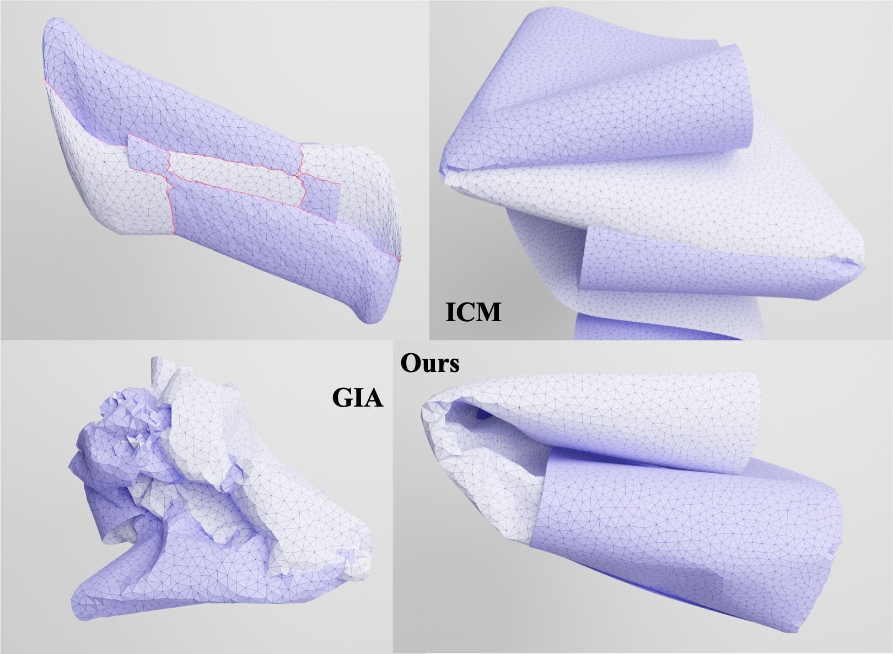
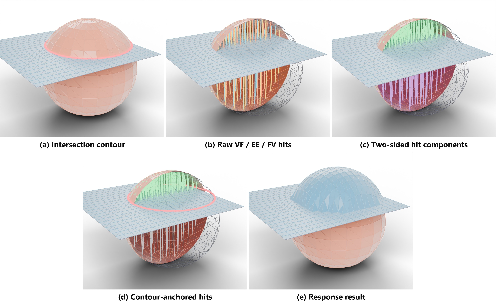
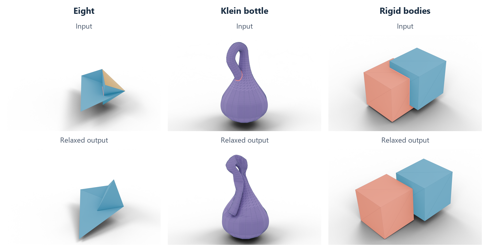
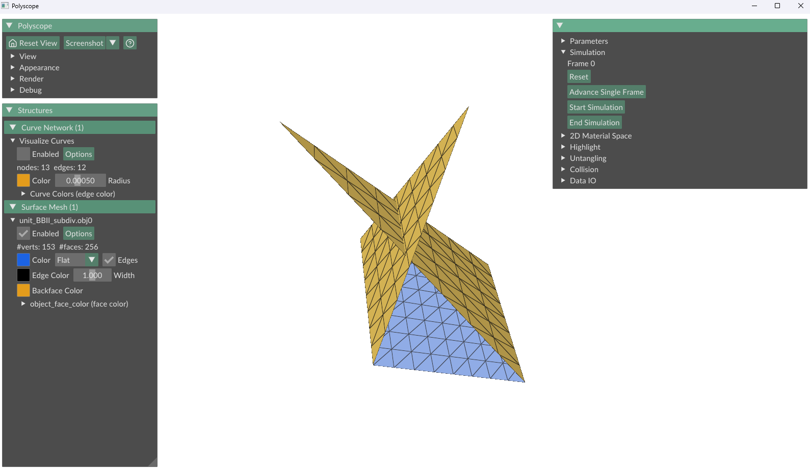
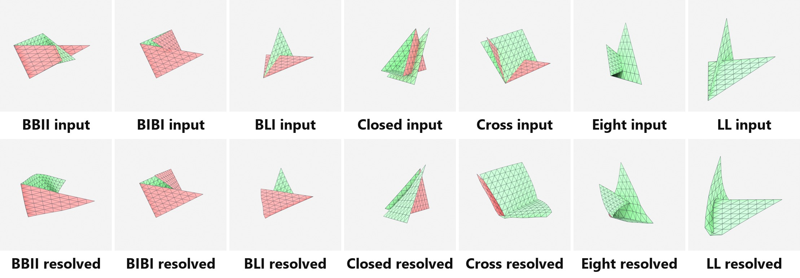
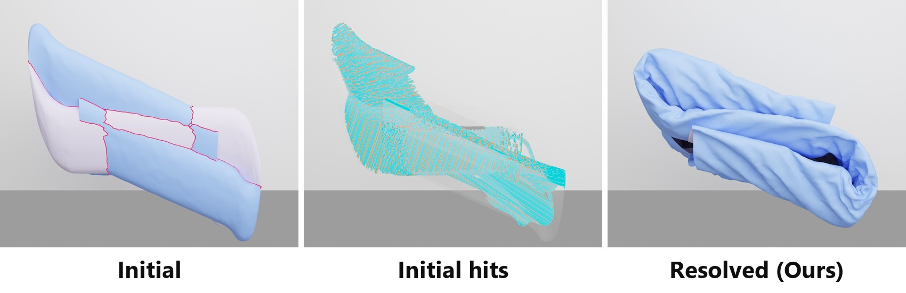
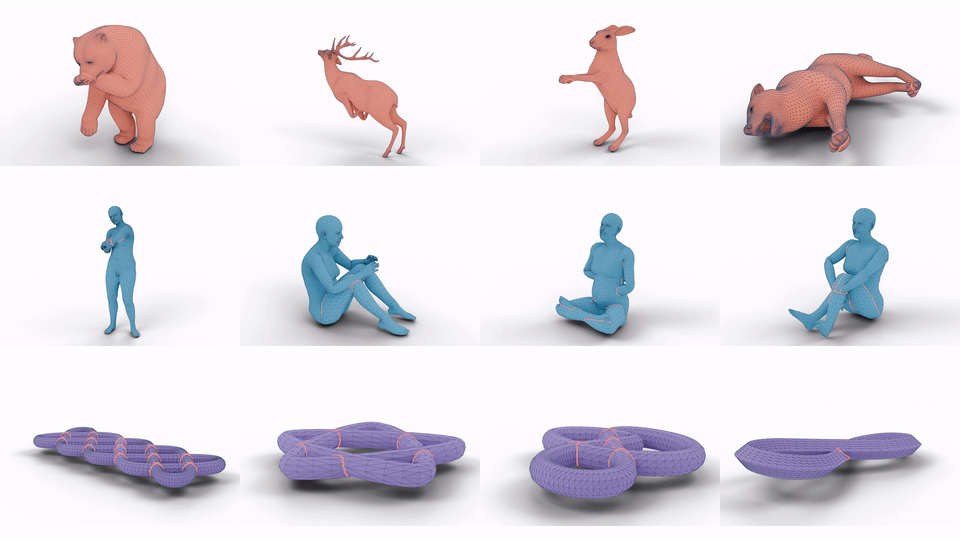
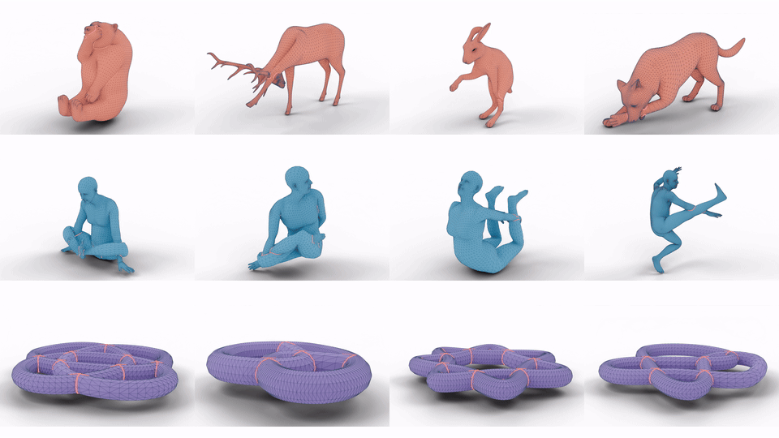

<div align="center">

# Type-Free Global Intersection Analysis with Linear Displacement Fields

### **ACM SIGGRAPH Asia 2026**

**[Chengzhu He](https://chengzhuuwu.github.io/)** &nbsp;·&nbsp; **[Xudong Feng](https://rullec.github.io/)** &nbsp;·&nbsp; **[Anjun Chen](https://chen3110.github.io/)** &nbsp;·&nbsp; **[Dan Song](https://zengjianhao.github.io/DanSongGroup/)** &nbsp;·&nbsp; **[Shihui Guo](https://www.humanplus.xyz/)** &nbsp;·&nbsp; **[Kui Wu](https://kuiwuchn.github.io/)**


<p align="center">
  <a href="https://chengzhuuwu.github.io/publication/siggraph-asia-2026-untangling/"></a>
  <a href="https://chengzhuuwu.github.io/files/untangling_siggraph_asia_2026.pdf"></a>
  <a href="https://chengzhuuwu.github.io/files/untangling_supplemental.pdf"></a>
  <a href="https://youtu.be/cs_592tRAZQ"></a>
</p>

<p align="center">
  <a href="https://github.com/ChengzhuUwU/Untangling26/actions/workflows/build_cmake.yml"></a>
  <a href="https://github.com/ChengzhuUwU/Untangling26/actions/workflows/build_wheels.yml"></a>
</p>

<p align="center">
  
</p>

</div>

---

## Overview

Removing self-intersections and penetrations between bodies is hard when the simulation has no intersection-free history to fall back on. Global intersection analysis (**GIA**) classifies each intersection contour into a topological type and builds a 2D region that separates the two sides. This breaks down on contours that end at open boundaries, on figure-eight self-intersections, and on several nested layers. Intersection contour minimization (**ICM**) needs no classification, but it only follows the local gradient along the intersection curves and often gets stuck when the penetration is deep.

We propose a **type-free** global intersection analysis. For a contour, a separation direction $\mathbf{r}\in\mathbb{S}^2$, and its (filtered) set of response hits $\mathcal{S}(\mathbf{r})$, we measure the cost of separating along $\mathbf{r}$ with a mass-weighted $L_2$ displacement, analogous to the inertial term $\sum_i m_i \|\Delta\mathbf{x}_i\|^2$:

$$
\begin{aligned}
D_{\mathcal{C}}(\mathbf{r})
&=\max_{h\in\mathcal{S}(\mathbf{r})}\delta_h(\mathbf{r})\\
J(\mathbf{r})
&= \sum_{h\in\mathcal{S}(\mathbf{r})} m_h\, D_{\mathcal{C}}(\mathbf{r})^2
 = \rho\, D_{\mathcal{C}}(\mathbf{r})^2 \sum_{h\in\mathcal{S}(\mathbf{r})} A_h
\end{aligned} 
$$

Here $m_h = \rho\, A_h$ is the mass of hit $h$, computed from the area $A_h$ of its source and destination primitives and the surface density $\rho$, and $D_{\mathcal{C}}(\mathbf{r})$ is the largest ray travel distance in the contour. All hits in $\mathcal{S}(\mathbf{r})$ share this depth $D_{\mathcal{C}}$. We treat $\rho$ as a uniform constant and drop it. Minimizing $J(\mathbf{r})$ picks the direction that needs the smallest mass-weighted displacement, so the separation follows the low-energy displacement modes of the physics solver.


Each contour $\mathcal{C}$ formed by the detected edge–face (EF) intersection pairs seeds one separation response. The pipeline alternates between two steps: with the state $\mathbf{x}$ fixed, find the best direction $\mathbf{r}^\star = \arg\min J(\mathbf{r})$ for each contour; with $\mathbf{r}^\star$ fixed, advance $\mathbf{x}$ with the global IP solver.

1. **Initialize** candidate directions $\mathbf{r} \in \mathcal{D}_0$ from the local geometry of the contour.
2. **Cast** along each candidate and collect the raw hit set $\mathcal{H}_{\mathrm{raw}}(\mathbf{r})$ with vertex–face (VF), edge–edge (EE), and face–vertex (FV) intersection tests.
3. **Filter** the raw hits with dual-sided product-complex cluster culling, keeping only the component $\mathcal{S}(\mathbf{r})$ attached to the contour.
4. **Refine** the selected candidates with projected Newton or Cauchy steps on $\mathbb{S}^2$, re-evaluating $J(\mathbf{r})$ on the filtered hits at each trial.
5. **Assemble** the final hit set into solver constraints $\{C_k\}$ and advance $\mathbf{x}$.

<p align="center">
  
</p>

The method does not use collision history and does not distinguish contour types. It runs on the GPU through [LuisaCompute](https://github.com/LuisaGroup/LuisaCompute), with CUDA, DirectX 12, Vulkan, and Metal backends.

> **Limitations.** The method does not guarantee that every intersection is removed. For self-intersections in heavily tangled regions, cluster culling may fail to keep the ray-cast hits that actually push the surfaces apart. For rigid bodies, the solver can get stuck when a body is caught in a hollow or concave part of another.


## Quick Start

### Install

`untangling26` is [on PyPI](https://pypi.org/project/untangling26/0.2/).

Version 0.2 has **CPython 3.13** wheels for all three platforms:

| Platform | Architecture / minimum OS | Backend |
|---|---|---|
| Windows | x64 | Vulkan (`vk`) |
| Linux | x86-64, glibc 2.28+ | Vulkan (`vk`) |
| macOS | Apple Silicon (ARM64), macOS 15+ | Metal (`metal`) |

You need a compatible GPU. For other Python versions, architectures, or backends, [build from source](#building-from-source).

Inside a Python 3.13 environment:

```bash
python -m pip install untangling26==0.2
untangling26 --version
```

To create one on Windows with the Python launcher:

```powershell
py -3.13 -m venv .venv
.\.venv\Scripts\Activate.ps1
python -m pip install untangling26==0.2
```

Or let [uv](https://docs.astral.sh/uv/getting-started/installation/) fetch it and install the command into its own environment:

```bash
uv tool install --python 3.13 untangling26==0.2
```

### Command-line mesh repair

List the input files, then the output path:

```text
untangling26 INPUT [INPUT ...] OUTPUT [OPTIONS]
```

```bash
# Self-intersecting surface (deformable repair is the default)
untangling26 folded.obj repaired.obj

# Two intersecting bodies placed in the same world coordinates
untangling26 body_a.obj body_b.obj out/ --material rigid

# A scene, or a mesh made of several disconnected rigid parts
untangling26 assembly.glb repaired.glb --material rigid

# Deeply folded cloth: smaller corrections, more iterations
untangling26 folded.obj out/ --response-depth 0.005 --max-iters 400

# Run both the physics solve and contour evaluation on the GPU
untangling26 folded.obj repaired.obj --backend vk --physics gpu --gpu-untangling

# Only check and export the input, without repairing
untangling26 folded.obj checked.obj --max-iters 0

# Same as the first example, run as a module
python -m untangling26 folded.obj repaired.obj
```

<p align="center">
  
</p>


**Material.** `--material cloth` (the default) deforms the surface to remove self-intersections. `--material rigid` moves whole bodies apart, and in this mode each disconnected component becomes its own body. A rigid body cannot fix its own self-intersections; use `cloth` for those. All input files must be in the same world coordinates.

**Backend.** `--backend auto` picks Vulkan on Windows/Linux and Metal on macOS. On macOS, replace `--backend vk` with `--backend metal` in the GPU example. CUDA and DirectX need a source build that includes them. Physics and contour evaluation run on the CPU by default. `--physics gpu` and `--gpu-untangling` move each of them to the GPU independently.

**Input and output.** The command runs without a viewer and reads OBJ, PLY, STL, OFF, GLB, and GLTF. Scene-instance transforms and the relative placement of bodies are kept. For the solve, all inputs are scaled **together** so that the largest extent is 1; the output is mapped back to the original coordinates and units. Only triangle geometry and body names are written. Materials, textures, and animation are dropped.

- `repaired.obj` or `repaired.glb`: the whole repaired scene, plus a report `repaired.json` next to it.
- `out/` (a directory): `resolved.obj`, one OBJ per body when there are several bodies, and the report `summary.json`.

The report records the configuration, the normalization transform, the intersection counts per iteration, and whether the exported mesh has zero detected EF intersections. If the iteration budget runs out, the last checked mesh is still exported. Existing files are only replaced with `--overwrite`, and inputs are never overwritten.

Exit code `0` means no intersections are left, `1` means some remain, and `2` means an input, configuration, or runtime error.

**Iterations.** Each repair update is one Newton iteration. `Iteration 0` in the log is the input; iteration *k* is the mesh after *k* accepted updates. A final collision check runs before export, so the report matches the saved file.

| Option | Default | Meaning |
|---|---|---|
| `--material cloth\|rigid` | `cloth` | Deform the surface, or move rigid bodies apart. |
| `--split-components` / `--no-split-components` | on for `rigid` | Treat disconnected components as separate bodies. Separate files and scene nodes are always separate bodies. |
| `--backend auto\|cuda\|vk\|dx\|metal` | `auto` | Compute backend. It must be included in the installed build. |
| `--physics cpu\|gpu` | `cpu` | Where the Newton/PCG solve runs. Collision detection uses the GPU either way. |
| `--gpu-untangling` | off | Evaluate PRP contours on the GPU. |
| `--max-iters` | `200` | Maximum number of repair updates. `0` only checks and exports the input. |
| `--response-depth` | `1.0` | Cap on the requested correction, in normalized units. Lower it for deep folds. |
| `--direction-iters` | `0` | Direction-refinement trials per Newton iteration. |
| `--pcg-iters` | `200` | PCG iteration budget. |
| `--max-contours` | `256` | Contours processed per repair update. |
| `--no-ccd` | CCD on | Turn off CCD step-size checking. |
| `--overwrite` | off | Replace existing outputs (never the inputs). |

Run `untangling26 --help` for the full list. "Resolved" here means no surface intersections were detected. It does not rule out one solid sitting inside another, and the solver is not guaranteed to converge on every input.

### Interactive demos (optional)

The demo scripts and meshes are in the repository, not in the wheel. Clone it and install the wheel for your platform together with the viewer:

```bash
git clone https://github.com/ChengzhuUwU/Untangling26.git
cd Untangling26
uv venv --python 3.13
uv pip install "untangling26[gui]==0.2" triangle
```

<details>
<summary><b>With Conda</b></summary>

```bash
conda create -n untangling python=3.13 -y
conda activate untangling
pip install "untangling26[gui]==0.2" triangle
```
</details>

Then run the canonical demo. On macOS, replace `--backend vk` with `--backend metal`. `--no-sync` stops uv from rebuilding the checkout over the installed wheel. In a Conda environment, use `python` instead of `uv run --no-sync python`.

```bash
# Interactive Polyscope viewer
uv run --no-sync python PythonBindings/tests/demo_unit.py --backend vk --scene_id 0

# Headless, for automated benchmarks
uv run --no-sync python PythonBindings/tests/demo_unit.py --backend vk --scene_id 0 --headless --advance_frames 1
```

---

## Building from Source

Build from source to use a different Python version, architecture, or backend, or to modify the solver. The steps are the same on every platform:

```bash
# 1. Clone
git clone https://github.com/ChengzhuUwU/Untangling26.git
cd Untangling26
git submodule update --init --recursive

# 2. Python 3.13 environment and build dependencies
uv venv --python 3.13
uv pip install scikit-build-core pybind11 ninja numpy trimesh triangle polyscope

# 3. Configure (CMake finds the local .venv)
cmake -S . -B build -G Ninja \
  -D CMAKE_BUILD_TYPE=Release \
  -D LCS_BUILD_PYBINDINGS=ON \
  -D LCS_BUILD_MAIN_APPLICATION=OFF \
  -D LUISA_COMPUTE_ENABLE_CUDA=OFF \
  -D LUISA_COMPUTE_ENABLE_METAL=OFF \
  -D LUISA_COMPUTE_ENABLE_VULKAN=ON

# 4. Build the Python module and its runtime libraries
cmake --build build -j 4

# 5. Install the package and the CLI into .venv (editable)
uv pip install -e . --no-build-isolation -C build-dir=build
```

In PowerShell, replace each trailing `\` with a backtick (`` ` ``), or write the `cmake` command on one line.

#### Configurations

The commands above build the Vulkan backend for Windows or Linux. On Apple Silicon, use `-D LUISA_COMPUTE_ENABLE_VULKAN=OFF -D LUISA_COMPUTE_ENABLE_METAL=ON` instead. Other options for step 3:

- **Build tools**:
  - CMake 3.26 or newer ([releases](https://github.com/Kitware/CMake/releases)).
  - Ninja, the recommended generator ([releases](https://github.com/ninja-build/ninja/releases)).
  - Clang, MSVC, or GCC. To pick Clang: `-D CMAKE_C_COMPILER=clang -D CMAKE_CXX_COMPILER=clang++`.
- **Python environment**: with `-D LCS_BUILD_PYBINDINGS=ON`, CMake uses the active Python environment (uv, conda, venv, or a `.venv` in the repository root) and refreshes its cache when you switch environments. To use a specific interpreter, pass `-D LCS_PYTHON_EXECUTABLE=/path/to/python`.
- **GPU backends**: LuisaCompute enables the backends it finds. To set them explicitly:
  - **Vulkan** (Windows, Linux, macOS): `-D LUISA_COMPUTE_ENABLE_VULKAN=ON`
  - **CUDA** (NVIDIA GPUs on Windows and Linux): `-D LUISA_COMPUTE_ENABLE_CUDA=ON`
  - **DirectX 12** (Windows): `-D LUISA_COMPUTE_ENABLE_DX=ON`
  - **Metal** (Apple Silicon macOS): `-D LUISA_COMPUTE_ENABLE_METAL=ON`

In Vulkan builds, `LCS_ENABLE_DEVICE_LOG` defaults to `OFF`: kernel `printf` forces a legacy compiler path that cannot lower floating-point atomics. Host-side diagnostics, device assertions, and BVH health flags still work. Other backends keep kernel `printf` on by default.

The built module goes to `build/bin`; the benchmark scripts add this directory to `sys.path` themselves.

## Demos and Benchmarks

Run these from the repository root, with either the PyPI wheel installed or `lcs_py` built from source.

The commands below use `--backend vk`, the backend in the Windows/Linux wheels. On macOS, use `--backend metal`. With a source build, pass a backend you compiled in. `uv run --no-sync` runs in the existing `.venv` without reinstalling the project:

```bash
uv run --no-sync python PythonBindings/tests/demo_unit.py --backend vk --headless --advance_frames 100
```

If the environment is already activated (`.venv\Scripts\activate` or `source .venv/bin/activate`), plain `python PythonBindings/tests/...` works too.

The first run is slow because LuisaCompute JIT-compiles the device kernels. They are cached next to the native runtime (`build/bin/.cache` for a source build). Results are written to `output/paper_cases/`.

Release validation: Version 0.2 installed from public PyPI passed repair tests on Windows 11 with an NVIDIA RTX 5070 and Ubuntu 22.04 with an RTX 3090. Both CPU and GPU physics/contour evaluation resolved the canonical Eight, intersecting rigid cubes, and Klein bottle; every exported mesh passed a fresh zero-intersection check. The Ubuntu test also passed with default Vulkan device selection. Earlier tests on software Vulkan and WSL's D3D12 Vulkan driver encountered convergence, buffer-limit, and pipeline-creation failures; those environments are not substitutes for the tested native NVIDIA driver. The macOS package preserves the released Metal solver code, with corrected library paths and verified signatures; Metal execution has not been tested for this package update.

Every demo below opens a Polyscope viewer unless you pass `--headless`. In the viewer, **Space / Advance Single Frame** steps one frame, **Run / Start Simulation** plays, and **Pause / End Simulation** stops.

<p align="center">
  
  <br><em>Polyscope GUI: inspect meshes and advance the simulation interactively.</em>
</p>

### Canonical Configurations (Wicke et al. 2006)

The seven canonical boundary and closed contour configurations from Wicke et al.: BBII, BIBI, BLI, Closed, Cross, Eight, and LL. In our tests, every case reaches zero EF intersections within 2–5 solver iterations, with contour evaluation on either the CPU or the GPU. Add `--export_debug` to write per-frame OBJ/NPZ files.

<p align="center"></p>

One case (`--scene_id` 0–6):
```powershell
uv run --no-sync python PythonBindings/tests/demo_unit.py `
    --backend vk --headless --advance_frames 100 `
    --use_subdivision --subdiv_levels 3 --scene_id 0
```

All seven in a loop:

```powershell
0..6 | ForEach-Object {
  uv run --no-sync python PythonBindings/tests/demo_unit.py `
    --backend vk --headless --advance_frames 300 `
    --use_subdivision --subdiv_levels 3 --scene_id $_
  if ($LASTEXITCODE -ne 0) { throw "Canonical unit $_ failed" }
}
```

### Synthetic Fold

A procedurally generated multi-layer fold with deep, nested self-intersections:

<p align="center"></p>

```powershell
uv run --no-sync python PythonBindings/tests/demo_synthetic.py `
  --backend vk --headless --advance_frames 400 `
  --start_from_initial 1 --use_ccd_linesearch 0 `
  --untangling_response_depth 0.005 `
  --max_ef_pairs 10000
```

### Jang59 Benchmark

Cases from the [benchmark](https://github.com/wonjongg/instant-mesh-intersection-repair) of Instant Self-Intersection Repair (ISIR, Jang et al. 2025). Each animation below shows 12 of them: four animals, four humans, and four other meshes. Red curves are the detected intersections.

<p align="center">
  
</p>

<p align="center">
  
</p>

The sample scenes from the ISIR repository are included as a submodule:

```powershell
git submodule update --init external/instant-mesh-intersection-repair
```

`--dry_run` checks the case order and file hashes without loading the solver:

```powershell
uv run --no-sync python PythonBindings/tests/test_batch_method_comparison_enhanced.py `
  --backend vk --begin 1 --end 59 --dry_run
```

Then run the benchmark:

```powershell
uv run --no-sync python -u PythonBindings/tests/test_batch_method_comparison_enhanced.py `
  --backend vk --headless --begin 1 --end 59 `
  --advance_frames 100 --timeout 300 --no_export_per_frame
```

The full 59-case `Dataset_distributed` set is under its original distribution terms. Request it from the ISIR authors (wonjong@postech.ac.kr) and pass `--jang_dataset <directory>` to run all of it.

To look at a single case in the viewer, drop `--headless` and select it, e.g. `--begin 1 --end 1`. When several cases or methods are selected, closing a finished viewer opens the next one; closing it early cancels the remaining runs and writes a partial report. `--timeout` only applies in headless mode, and `--dry_run` never opens a viewer.

### Static Repair from a Single OBJ

`test_load_from_obj.py` is the research version of `untangling26 input.obj output.obj`, with more benchmark options. It loads an OBJ mesh, untangles it quasi-statically (no gravity, no floor), writes the result as an OBJ, and exits with code 0 only if no intersections remain. This example repairs the Klein bottle from the ISIR submodule:

```powershell
uv run --no-sync python PythonBindings/tests/test_load_from_obj.py `
  --backend vk --headless `
  --input_mesh external/instant-mesh-intersection-repair/data/misc/disc_kleinbottle.obj
```

### Thingi10K Rigid Solids

Deep penetrations between watertight rigid solids (`MaterialType::Rigid`) from Thingi10K. With `config.PRP_solid_interior_adjacency = True`, the entry and exit hits of a ray through a solid are linked across its interior, so hits on opposite sides of a thick part are not treated as disconnected. The benchmark runs 8 watertight models (300–2,600 faces) with contour evaluation on the CPU and on the GPU, each with surface-only adjacency and with interior adjacency:

```powershell
uv run --no-sync python PythonBindings/tests/test_thingi10k_rigid_untangling.py `
  --backend vk --headless --max_frames 35
```


Without `--headless`, the script opens one model in the viewer. Pick it with `--case_index 1`–`8` (default `1`), and choose the configuration with `--use_gpu 0|1` and `--solid_adj 0|1` (both default `0`):

```powershell
uv run --no-sync python PythonBindings/tests/test_thingi10k_rigid_untangling.py `
  --backend vk --case_index 1 --solid_adj 1 --max_frames 35
```


## Acknowledgments

Thanks to [Xudong](https://rullec.github.io/) for guidance, and to the [LuisaCompute](https://github.com/LuisaGroup/LuisaCompute) community for development support.

This project builds on [LuisaComputeSimulator](https://github.com/ChengzhuUwU/LuisaComputeSimulator) and [LuisaCompute](https://github.com/LuisaGroup/LuisaCompute).

Related code:
- [Unreal Engine](https://github.com/EpicGames/UnrealEngine/blob/release/Engine/Source/Runtime/Experimental/Chaos/Private/Chaos/PBDTriangleMeshCollisions.cpp): EF intersection detection, and the ICM and GIA baselines.
- [instant-mesh-intersection-repair](https://github.com/wonjongg/instant-mesh-intersection-repair): the mesh intersection repair benchmark.

## License

The source code is released under the [Apache License 2.0](LICENSE).

For questions, contact `chengzhuhe@stu.xmu.edu.cn`.
