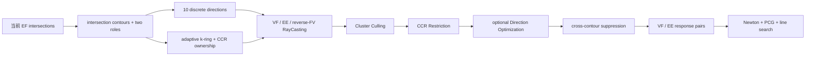

# RayCasting Untangling：当前实现、CCR 与 Direction Optimization

## 1. 项目解决什么问题

RayCasting Untangling 面向已经发生大范围、嵌套或自相交的薄壳/布料状态。IPC 一类 barrier 方法通常要求初态无穿透；本项目处理的是另一阶段：从当前 edge-face（EF）相交集合直接构造有方向的分离响应，使 Newton 求解器能够在不知道碰撞历史的情况下逐步消除相交。

对每条 intersection contour \(\mathcal C\)，当前 PRP 路径完成四件事：

1. 从 EF pairs 构造 contour 及其两个逻辑 role；
2. 在 contour 邻域生成候选 V/E/F，并沿候选方向执行 VF、EE、reverse-FV RayCasting；
3. 用乘积拓扑上的 Cluster Culling 提取与 contour 相连的响应带，再由 Contour-Sid Candidate Restriction (CCR) 决定有效范围和最佳方向；
4. 把 hits 转成标准 VF/EE penalty pairs，装配进 Newton Gradient/Hessian。



这里的输出不是一条可视化方向，而是一组四顶点碰撞模板：

$$
\mathcal R
=
\left\{
(\mathbf i_h,\mathbf w_h,\mathbf n_h,k_{1,h},k_{2,h},A_h,\ell_h)
\right\}_{h=1}^{N_R}.
$$

其中 \(\mathbf i_h\) 是四个顶点索引，\(\mathbf w_h\) 是 VF/EE 仿射权重，\(\mathbf n_h\) 是分离方向，\(k_1,k_2\) 是局部线性项和二次项系数，\(A_h\) 是响应面积，\(\ell_h\) 保存 contour、role 和 solution 标签。

### 1.1 研究背景

经典物理求解器处理碰撞时依赖无穿透初态；而在解缠绕阶段，求解器必须在已经发生穿透的网格上搜索正确的分离冲量。PRP 采用的光线投射（RayCasting）是在三维欧氏空间 \(\mathbb{R}^3\) 中进行的，其几何本质是将流形几何通过商空间投影 \(\pi_{\mathbf{r}}: \Sigma_0 \times \Sigma_1 \to \mathbb{R}^3\) 进行求交搜索。

## 2. 当前计算流程

一次物理帧包含若干 Newton iterations。每轮的顺序是：

1. 由当前自由度装配惯性、材料、固定约束和地面项。
2. 更新普通 VF/EE 接触，并对 edge-face 做不裁剪 broad phase 和精确 EF DCD。
3. 把 EF pairs 预处理为 intersection contours；role 0/1 只在当前 contour 内有意义，自相交时两个 role 可以属于同一 object。
4. 为每条 contour 构建 runtime、边界 anchors、候选域、hop/geodesic 距离及名义 10 个方向。
5. 从初始 k-ring 开始构造 partial candidates；在开启 Contour-Side Candidate Restriction 时，在每个 k-level 先做 contour-side ownership。
6. 对每个方向执行 RayCasting 和 Cluster Culling。
7. 若 `PRP_direction_optimization_iterations>0`，从离散 winner 出发做至多指定次数的单位球切空间优化，每个 trial 都重新运行当前 CPU/GPU 后端的完整离散评价。
8. 执行跨 contour 的 directed greedy response suppression，把保留 hits 转成 VF/EE collision templates。
9. 过滤与 PRP 语义区域冲突的普通 proximity/CCD pairs，装配统一接触能量。
10. PCG 解 Newton 系统；随后执行 energy line search，并按配置执行 CCD line search。

CPU physics 与 GPU physics 都可调用 CPU 或 GPU PRP contour evaluation；`use_gpu`（PCG/physics backend）与 `use_gpu_untangling`（PRP contour evaluation backend）是两个独立开关。

### 2.1 数值与系统阻塞项清除原则 (Phase A Clearance)

在将解缠绕算法扩展至大规模与退化网格时，求解内核确立了三条系统与数值稳定性原则：

1. **Fixed-Point Narrowphase 缓冲区自适应扩容（`newton_solver.cpp`）**：
   - 原系统在 DCD/CCD 遭遇容量不足时仅做单次重试，在超大初始相交对场景（如 `wrapped_cylinder_7x` 达 132 万 EF 对）下因首轮小容量截断了真实请求量而导致重试再次失败并抛出 `LUISA_ERROR`。
   - 现重构为最多 10 次的 Fixed-point Retry 循环，并在 CCD 重试前显式重置计数器 `reset_broadphase_count(stream)`，保证百万级接触对稳定装配。
2. **退化二面角几何过滤与安全 Hessian 正则（`init_sim_data.cpp`, `bending_energy.h`）**：
   - 针对包含零面积三角形与零长度边的奇异网格（如 `jeener`, `romaine`），在约束初始化阶段通过 `bending_edge_has_valid_geometry` 剔除退化铰链，并在计算二面角法向模长与二阶导数时引入安全下限 \(\max(\cdot, 10^{-12})\)，彻底消除注入 Jacobi Preconditioner 的 NaN/Inf，使 GPU PCG 100% 稳定。
3. **退化边界相交复形保留（`intersection_resolver.cpp`）**：
   - 原过滤逻辑误将不邻接非退化对的纯边界/顶点接触 EF 全部丢弃，导致 `2d_intersection`, `crossed_cylinder`, `sqrt_riemann`, `whitney_umbrella` 等向求解器虚假上报 `EF=0`。
   - 现引入 Generalized EF Complex 保留规则：当检测到所有相交对均为边界退化时，完整保留连通分支并规范化送入 PRP 轮廓求解器，确保真实的物理穿透被正确消除。


## 3. Contour runtime 与候选域

EF narrow phase 给出相交 edge、face、barycentric coordinates 和相交点。预处理根据扩展邻接把 EF pairs 连成 contours，并为每个 pair 统一 role。每个 `PrpStandardContourRuntime` 保存：

- contour EF pair indices；
- 两侧 object id 和 topology-component id；
- contour-adjacent V/E/F anchors；
- 完整候选 V/E/F 及当前 k-level 的 partial candidates；
- 从两侧 anchors 出发的 hop 和 rest-geodesic distance；
- directions、每个 combo 的状态、hit list、coverage 和 objective；
- CCR 的 lazy current-space distance cache；

某些未分类但两侧均闭合、包含多个 loop vertices 的 branched contour 会先按 cut topology 限制到较小闭合区域。该规则独立于 CCR；CCR 在当前 k-ring 候选上继续做 role ownership。

## 4. 当前名义 10 个方向

令 contour intersection samples 为 \(\mathbf p_i\)，权重为 \(\omega_i\)，contour center 为

$$
\mathbf c_{\mathcal C}
=
\frac{\sum_i\omega_i\mathbf p_i}{\sum_i\omega_i}.
$$

对 role \(r\in\{0,1\}\) 的 contour-adjacent vertices，以 rest vertex area \(a_v\) 加权得到 role center \(\mathbf c_r\)。联合 scatter matrix 为

$$
\mathbf S_w
=
\sum_{r=0}^{1}\sum_{v\in\mathcal B_r}
a_v(\mathbf x_v-\mathbf c_{\mathcal C})
(\mathbf x_v-\mathbf c_{\mathcal C})^\mathsf T.
$$

当前名义方向由三组组成：

| 来源 | 数量 | 方向 |
|---|---:|---|
| 联合 scatter eigenvectors | 6 | 三个 eigenvectors 的正负方向 |
| contour-to-role-center | 2 | \(\mathbf c_{\mathcal C}-\mathbf c_0\)、\(\mathbf c_{\mathcal C}-\mathbf c_1\) |
| 全局质心径向 | 2 | \(\pm(\mathbf c_{\mathcal C}-\mathbf c_G)\)，\(\mathbf c_G\) 为全场景 rest-area 加权当前质心 |

旧的 `±(c1-c0)` “角色中心分离方向” 已删除。两个 role 在穿透状态下往往高度重叠，中心差既不稳定，也不能表达局部分离法向；保留它会占用两个离散 combo，却不提供可靠信息。

方向先检查有限性与长度，再归一化。退化的 contour-to-role-center 方向回退到 scatter axes；全局径向退化时跳过。只有所有候选均无效时才使用 contour proxy normal 的正负方向。因此“10 个”是正常非退化输入下的名义数量，不是无条件固定数组长度。

## 5. Adaptive k-ring

两侧初始半径分别由边界顶点数 \(B_r\) 和 mesh hop diameter \(D_r\) 决定：

$$
k_r^{(0)}=
\begin{cases}
3,&D_r=0,\\
\max\!\left(3,\min\!\left(\lceil\sqrt{B_r}\rceil,D_r\right)\right),&D_r>0.
\end{cases}
$$

在 level \(k\) 上：

- vertex 的 anchor hop distance 不超过 \(k\) 才进入；
- edge 的两个端点都不超过 \(k\) 才进入；
- face 的三个端点都不超过 \(k\) 才进入；
- CCR 若开启，再对上述集合做 side ownership filter。

若响应前沿尚未闭合，半径按 \(k\leftarrow\min(2k,D+1)\) 扩张。`PRP_region_extend_count` 只是安全下界，不再把搜索硬截在固定次数。

## 6. RayCasting 与 Cluster Culling

对方向 \(\mathbf d\)，三条 ray 路径统一产生 `HitInfo`：

- VF：source vertex 沿 \(\mathbf d\) 射向 target faces；
- EE：source edge 沿 \(\mathbf d\) 扫向 target edges；
- reverse-FV：target-side vertex 反向射向 source faces，随后在响应装配时规范化为 VF。

CPU 路径使用按 object 缓存的中位数 AABB BVH，face/edge/reverse-face 分开缓存，叶节点最多 8 个 primitives。GPU 路径使用 batched kernels 和 keyed-CSR scratch。二者共享 runtime 构建、CCR candidate filter、、Direction Optimization 接口和最终 response assembly。

Cluster Culling 不把 hits 当作普通 3D 点云。一个 hit 是 source primitive 与 target primitive 的乘积单元；两个 hits 只有在 source 侧和 target 侧同时满足相应的一阶 primitive adjacency/incidence 时才相邻。算法构造 hit graph，保留连接到 contour anchors、覆盖有效 EF anchors 的 component。这样能避免只按 vertex adjacency 把低分辨率自相交中的不同响应带错误粘连。

每个保留 response 记录 hit count、contour coverage、penetration depth、penetration objective 和 effective-mass displacement cost。若 response 被判定为 self-collision flipped，则该 contour 本轮不注入响应。

## 7. Contour-Side Candidate Restriction (CCR)

### 7.1 论文定义与代码实现的对应与拓展

论文在第 7.2 节中定义了 **Contour-Side Candidate Restriction (CCR)**，其核心思想是在 RayCasting 之前为各轮廓侧候选图元建立局域有效性边界，抑制切向擦边光线向远端非相交区域过度蔓延（grazing ray over-extension）：
$$
\phi_s(v) = \frac{c_s(v) - c_{1-s}(v)}{c_s(v) + c_{1-s}(v) + \varepsilon} \le \tau, \quad \text{where} \quad c_s(v) = \min_{a \in \mathcal{A}_s} \|\mathbf{x}_v - \mathbf{x}_a\|_2.
$$

**论文与代码实现的差异**：
- **论文形式**：采用当前变形 3D 空间中的欧氏弦距离（Euclidean chord distance $c_s(v)$）。
- **代码拓展**：在实际处理极端复杂的多层紧密自相交折叠时，纯 3D 欧氏距离容易穿透折叠褶皱间的自由空间“空气隙”（Air Shortcuts），误将相邻非穿透折叠层划入对侧区域。因此，工程代码引入了初始网格上的表面测地距离（Rest Surface Geodesic Distance $d_{s,\mathrm{rest}}(v)$，通过 Dijkstra 算法按边长计算），并支持将内蕴测地度量与变形欧氏度量结合。

---

### 7.2 归一化归属坐标 (Normalized Side Coordinates)

对候选顶点 $v$ 与轮廓侧角色 $s \in \{0, 1\}$，分别定义 rest 表面测地指标与当前变形欧氏指标：
- **初始表面测地坐标**：
  $$
  \phi_{s,\mathrm{rest}}(v) = \frac{d_{s,\mathrm{rest}}(v) - d_{1-s,\mathrm{rest}}(v)}{d_{s,\mathrm{rest}}(v) + d_{1-s,\mathrm{rest}}(v) + \varepsilon}
  $$
- **变形空间欧氏坐标**：
  $$
  \phi_{s,\mathrm{cur}}(v) = \frac{d_{s,\mathrm{cur}}(v) - d_{1-s,\mathrm{cur}}(v)}{d_{s,\mathrm{cur}}(v) + d_{1-s,\mathrm{cur}}(v) + \varepsilon}
  $$

归属坐标取值范围为 $[-1, 1]$：$\phi_s(v) \approx -1$ 表示该点紧贴所属角色侧锚点，$\phi_s(v) \approx 1$ 表示深入对侧。

---

### 7.3 过滤准则形式 (Filtering Criteria)

系统支持以下几种归属判定准则（阈值默认 $\tau = 0.25$）：

1. **凸组合混合 (Convex Combination Blend，当前实现默认)**：
   $$
   \phi_{\mathrm{blend}}(v) = w \cdot \phi_{s,\mathrm{rest}}(v) + (1 - w) \cdot \phi_{s,\mathrm{cur}}(v) \le \tau, \qquad w \in [0, 1]
   $$
   系统默认采用此形式（默认权重 $w = 0.75$）。当其中某一侧度量因连通性缺失不可达时，自适应回退到可用的单一度量。

2. **双重独立约束 (Dual Independent Constraints / Logical AND)**：
   要求测地归属与空间欧氏归属同时满足局部容差：
   $$
   \phi_{s,\mathrm{rest}}(v) \le \tau \quad \land \quad \phi_{s,\mathrm{cur}}(v) \le \tau
   $$

3. **纯当前变形欧氏空间 (Pure Deformed Euclidean Chord)**：
   仅根据三维空间欧氏距离判定，对应论文式 (14) 的原始表述：
   $$
   \phi_{s,\mathrm{cur}}(v) \le \tau
   $$

4. **纯初始表面测地线 (Pure Rest Surface Geodesic)**：
   仅根据初始网格上的内蕴表面测地距离判定，不受变形折叠空气隙影响：
   $$
   \phi_{s,\mathrm{rest}}(v) \le \tau
   $$

---

### 7.4 高阶图元保留规则 (Union Rule for Edges & Faces)

对候选边（Edge）与候选面（Face）：
- **保留准则**：只要其至少有一个关联顶点（incident vertex）满足所属角色的 $\phi \le \tau$ 阈值约束，该边或面即被保留进入 RayCasting 候选集。
- **设计考量**：采用并集支撑（Union Rule）可以防止在有效边界处切断高阶图元，为 RayCasting 的表面相交测试保留必要的离散连续性与重叠窗口。

## 8. Direction Optimization 新接口

### 8.1 配置接口

引擎和 pybind 暴露：

```text
SceneParams::PRP_direction_optimization_iterations
config.PRP_direction_optimization_iterations
```

统一 Python CLI 为：

```text
--prp_direction_optimization_iterations N
```

为兼容已有命令，保留两个 alias：

```text
--prp_optimize_direction_count N
--PRP_optimize_directon_count N
```

次数必须为非负整数。默认 `N=0`，此时函数立即返回，不产生额外 RayCasting，也不改变原离散方向选择。

### 8.2 局部模型

优化只从当前离散 winner 开始。对已接受方向 \(\mathbf r\) 的 hit \(h\)，取 characteristic normal \(\mathbf n_h\)：VF/FV 使用对应 face normal，EE 使用两 edge directions 的叉积，近共线时回退到两个 hit points 的差。

冻结当前 hit topology，令

$$
c_h=d_h(\mathbf r)(\mathbf n_h^\mathsf T\mathbf r),
\qquad
d_h(\mathbf u)=\frac{c_h}{\mathbf n_h^\mathsf T\mathbf u}.
$$

以 effective inverse mass \(\kappa_h\) 的倒数为权重，局部 surrogate 为

$$
F(\mathbf u)
=
\sum_h\frac{1}{\kappa_h}
\left(d_h(\mathbf u)+\delta\right)^2,
$$

其中 \(\delta=3\times10^{-3}\) 与当前 `displacement_cost` 的固定偏移 `prp_response_depth_offset` 一致；它不是可变的 `untangling_response_depth` 响应步长。在当前方向处，代码累积

$$
\nabla d_h
=
-\frac{d_h}{\mathbf n_h^\mathsf T\mathbf r}\mathbf n_h,
$$

以及

$$
\nabla^2F_h
=
\frac{2}{\kappa_h}
\frac{3d_h^2+2\delta d_h}
{(\mathbf n_h^\mathsf T\mathbf r)^2}
\mathbf n_h\mathbf n_h^\mathsf T.
$$

分母绝对值小于 \(10^{-6}\) 或几何/质量无效的 hit 不参与本次导数。

### 8.3 单位球更新与接受

Gradient 和 Hessian 投影到 \(\mathbf r\) 的二维切空间。二维 Hessian 正定时取 Newton step，否则使用 curvature-scaled steepest descent；step 被初始 trust radius 0.3 截断，再归一化回单位球。

surrogate 只提出 trial，不直接决定接受。每次 trial 都通过当前活动后端重新执行：

```text
candidate construction
-> CCR / Mode-12 range scheduling
-> VF/EE/FV RayCasting
-> Cluster Culling
-> CCR canonical selection
```

只有完整 canonical selection 在 `accepted` 与 `trial` 中选择 trial 时才接受。这里保留 `CleanComplete > SharedUpper` 的层级，而不只比较 objective。若实际/预测下降比大于 0.75，trust radius 最多扩大到 1.0；拒绝时半径减半，最低 0.01。

调试输出新增：

```text
opt_iter_count
opt_accepted_count
```

它们分别记录尝试次数和接受次数。`opt_selected` 表示该 combo 至少尝试过一次优化；`opt_eval.present` 只在至少一个 trial 被接受时为真，并导出最终接受的优化结果。Direction Optimization 同时接入 CPU 和 GPU PRP 路径，但 2026-09-01 尚无新的匹配消融结果；旧文档中的 Direction Optimization 数据不能迁移到该接口。

## 9. 跨 contour suppression 与响应装配

旧日志称为 Contour Merge 的步骤，当前更准确的含义是 directed greedy response suppression：

1. 记录每条 winner response 触及的其他 contour anchors；
2. 只在相同无序 object pair 内建立 directed adjacency；
3. 按确定性顺序扫描相邻 contours；
4. 比较 penetration area，抑制其中一个 response；
5. 不合并 contour geometry，也不重新 RayCasting。

保留 hit 被转成标准 collision template。FV 会反转为 VF；EE 保持四端点形式。响应面积为两侧 rest primitive measure 的均值，并有硬下界 \(3\times10^{-6}\)。令 stiffness 为 \(s\)，则

$$
k_2=A_hs,
\qquad
k_1=k_2C,
$$

其中

$$
C=\max(-d_{\max}-0.003,-d_{\mathrm{response}}).
$$

最终 PRP pairs 与普通 proximity pairs 进入同一 Gradient/Hessian 装配。packed region labels 同时用于普通接触过滤和 CCD broad-phase culling，防止正在修复的相交区域被普通 barrier 自己锁死。

## 10. PCG 中的 LM 正则化

在 Quasi-static 模式下，Untangling 产生的大量 Hits 可能会导致矩阵趋向于奇异，因此需要做额外的正则化。如果满足：

```text
current |dq|_inf > gate * first-Newton-step |dq|_inf
```

默认 gate 为 6，触发后对同一线性系统 one-shot 重解一次，lambda 为 0.

## 11. 代码索引

| 组件 | 文件/符号 |
|---|---|
| 参数默认 | `Solver/SimulationCore/scene_params.h` |
| pybind | `PythonBindings/src/python_bindings.cpp` |
| 统一 Python 参数 | `PythonBindings/tests/shared_args.py` |
| contour/runtime、CCR、CPU evaluator | `Solver/CollisionDetector/intersection_resolver2.cpp/.h` |
| GPU evaluator | `Solver/CollisionDetector/intersection_resolver_gpu.cpp` |
| hit adjacency/BVH helpers | `Solver/CollisionDetector/intersection_resolver_helper.cpp/.h` |
| PRP backend dispatch | `Solver/CollisionDetector/intersection_resolver.cpp` |
| LM 正则化 | `Solver/SimulationSolver/newton_solver.cpp` |
| 最新实验与 provenance | 根目录 `HANDOFF.md` 的 §20–22 |

关键函数：

```text
get_raycasting_direction
build_standard_candidates_at_level
evaluate_current_runtime_directions_template
prp_select_mode12_response
prp_optimize_runtime_directions
prp_finalize_selected_best_hit_infos
make_response_from_min_hitinfo
host_resolve_intersections_PRP
device_resolve_intersections_PRP
```
